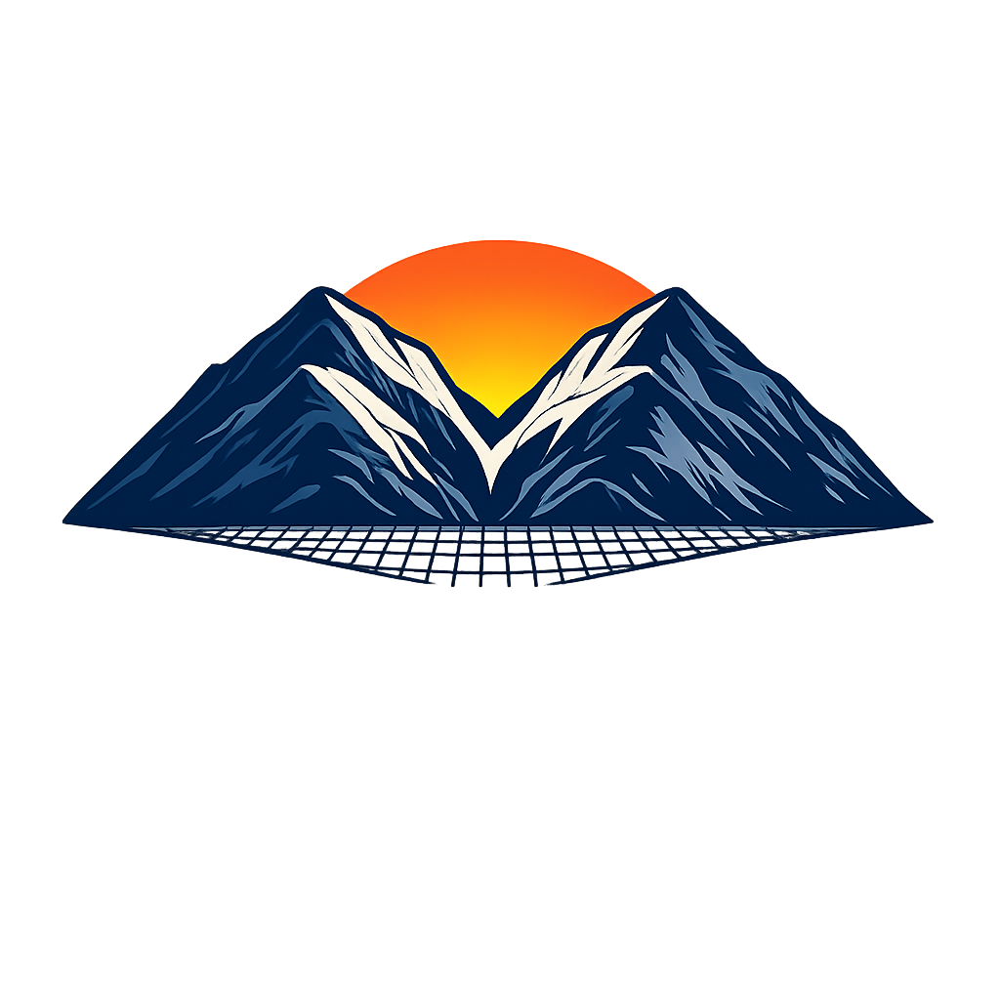
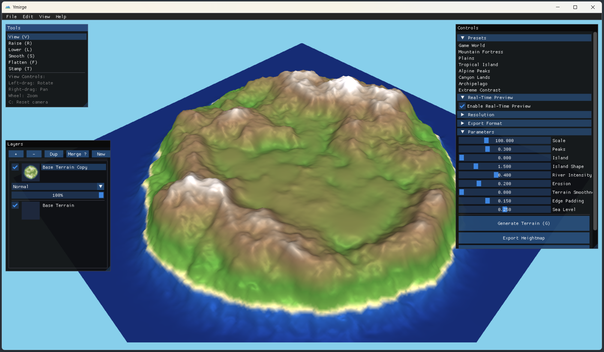

<p align="center">
  
</p>

<h1 align="center">Ymirge</h1>

<p align="center">
  <strong>Procedural Terrain Generator</strong><br>
  Real-time terrain sculpting with GPU-accelerated generation
</p>

<p align="center">
  <a href="https://github.com/LoxleyXI/Ymirge/releases"></a>
  <a href="https://github.com/LoxleyXI/Ymirge/blob/main/LICENSE"></a>
  
  
  <a href="https://github.com/LoxleyXI/Ymirge/actions"></a>
</p>

<p align="center">
  
</p>

---

## Features

### 🏔️ Terrain Generation
- **GPU-accelerated Perlin noise** — 20-30x faster than CPU
- **8 curated presets** — Game World, Mountain Fortress, Tropical Island, Archipelago, and more
- **Archipelago mode** — Generate multiple islands with configurable count and spacing
- **19+ parameters** — Scale, peaks, erosion, rivers, valleys, island shape

### 🎨 Sculpting Tools
- **5 brush types** — Raise, Lower, Smooth, Flatten, Stamp
- **Stamp library** — Procedural mountains, craters, plateaus
- **Real-time preview** — See changes as you sculpt

### 📚 Layer System
- **Photoshop-style layers** — Non-destructive compositing
- **8 blend modes** — Normal, Add, Subtract, Multiply, Screen, Max, Min, Overlay
- **50-level undo** — Delta-based storage for minimal memory usage

### 🌊 Advanced Algorithms
- **Hydraulic erosion** — Particle-based water simulation
- **Thermal erosion** — Slope-based material sliding
- **River carving** — A* pathfinding from edges to valleys
- **Valley flattening** — 3-pass system for gameplay areas

### 📦 Export Formats
- **PNG16** — 16-bit heightmaps for any engine
- **RAW16** — Direct import to Unity/Unreal
- **OBJ** — 3D mesh with normals and UVs
- **Splatmap** — RGBA texture for terrain materials

---

## Quick Start

### Download
Get the latest release from [Releases](https://github.com/LoxleyXI/Ymirge/releases).

### Build from Source

Requires [Zig](https://ziglang.org/download/) (0.13+) and SDL2.

```bash
git clone --recursive https://github.com/LoxleyXI/Ymirge.git
cd Ymirge

# Linux
sudo apt install libsdl2-dev libgl1-mesa-dev
zig build -p bin -Doptimize=ReleaseFast
./bin/ymirge

# Windows
# Install SDL2 development libraries
zig build -p bin -Doptimize=ReleaseFast
./bin/ymirge.exe
```

---

## Controls

| Action | Control |
|--------|---------|
| Rotate camera | Left-drag |
| Pan camera | Right-drag |
| Zoom | Scroll wheel |
| Reset camera | `C` |
| Undo | `Ctrl+Z` |
| Redo | `Ctrl+Y` |
| Tool shortcuts | `V` View, `R` Raise, `L` Lower, `S` Smooth, `F` Flatten, `T` Stamp |

---

## Game Engine Integration

### Godot 4

```gdscript
var image = Image.load_from_file("ymirge_heightmap.png")
var texture = ImageTexture.create_from_image(image)
terrain.height_map = texture
terrain.height_scale = 100.0
```

### Unity

Import the 16-bit PNG as a heightmap:
`Terrain → Import Heightmap → Select ymirge_heightmap.png`

### Unreal Engine

`Landscape → Import from File → Select ymirge_heightmap.png`

---

## Architecture

```
ymirge/
├── src/
│   ├── core/           # HeightMap, TerrainGenerator, ThreadPool
│   ├── algorithms/     # Erosion, rivers, valleys, peaks
│   ├── gpu/            # OpenGL compute shaders
│   ├── rendering/      # 3D terrain rendering
│   ├── layers/         # Layer compositing system
│   ├── tools/          # Brush and stamp tools
│   └── ui/             # ImGui interface
├── shaders/            # GLSL compute shaders
└── assets/             # Icons, stamps
```

---

## Tech Stack

| Component | Technology |
|-----------|------------|
| Language | C++17 |
| Graphics | OpenGL 4.3 + GLSL Compute |
| Windowing | SDL2 |
| UI | Dear ImGui |
| Threading | Custom thread pool |
| Image I/O | stb_image |

---

## Performance

| Resolution | Generation Time | GPU Speedup |
|------------|-----------------|-------------|
| 512×512 | ~50ms | 20x |
| 1024×1024 | ~150ms | 25x |
| 2048×2048 | ~400ms | 30x |
| 4096×4096 | ~1.2s | 30x |

*Tested on NVIDIA GTX 1070*

---

## License

MIT License — Free for personal and commercial use.

---

<p align="center">
  <sub>Built with C++, OpenGL, and caffeine ☕</sub>
</p>
